# 🧠 Multi-Agent System – Technical Documentation

This document outlines the architecture, agents, tools, workflows, and enhancement opportunities for the multi-agent system built using the `pydantic-ai` framework. The solution emphasizes intelligent orchestration, reliable data handling, and scalability for business-oriented workflows.

---

## ⚙️ System Components

### 🛠️ Tools

The system includes the following tools:

* `create_transaction` – Records sales or inventory transactions and returns a transaction ID.
* `get_all_inventory` – Retrieves inventory levels for all items as of a specified date.
* `get_stock_level` – Returns the stock level of a specific item.
* `get_supplier_delivery_date` – Estimates supplier delivery dates based on quantity and order date.
* `get_cash_balance` – Calculates current cash balance from sales and purchase transactions.
* `generate_financial_report` – Produces a financial summary including inventory value, assets, and top-performing products.
* `search_quote_history` – Searches historical quotes for matching customer requests.

---

## 🤖 Agents

### 🧩 Orchestrator Agent

Acts as the central controller. It receives customer requests, classifies them as **INQUIRY** or **ORDER**, and routes them to the appropriate agents.

### 📦 Inventory Agent

Handles stock validation, delivery estimation, and automatic reordering when inventory is insufficient.

**Tools used:**

* `get_stock_level`
* `get_supplier_delivery_date`
* `create_transaction`

### 💬 Quote Agent

Generates customer quotes using pricing strategies, historical quotes, and discount logic.

**Tools used:**

* `search_quote_history`
* `generate_financial_report`

### 🧾 Sales Finalization Agent

Finalizes orders by validating inventory, calculating delivery timelines, and recording sales transactions.

**Tools used:**

* `get_supplier_delivery_date`
* `create_transaction`

### 🧮 Invoice Agent

Creates structured plain-text invoices, inserts `<placeholder>` values for missing customer details, and highlights applied discounts.

---

## 🔄 Workflow Overview

The workflow demonstrates how agents collaborate to process customer requests.

### 💡 Process Flow

* The **Orchestrator Agent** classifies requests as **INQUIRY** or **ORDER**.
* For inquiries, the **Inventory Agent** provides stock availability and delivery estimates.
* For orders:

  * The **Inventory Agent** validates stock and triggers reorders if required.
  * The **Quote Agent** prepares a tailored quotation.
  * The **Sales Finalization Agent** records the sale and confirms delivery details.
  * The **Invoice Agent** generates the final invoice with placeholders and discount details.

### 🧠 Agent Responsibilities

| Role             | Responsibility                                          |
| ---------------- | ------------------------------------------------------- |
| **ORCHESTRATOR** | Request classification and workflow coordination        |
| **INVENTORY**    | Stock validation, delivery estimation, reorder handling |
| **QUOTE**        | Quote generation and pricing logic                      |
| **SALES**        | Order finalization and transaction recording            |
| **INVOICE**      | Plain-text invoice generation                           |

---

## 🧰 Technology Stack

The solution is implemented in Python using the `pydantic-ai` framework with SQLite for inventory and transaction storage.

### 🚀 Why `pydantic-ai`?

* **Strict Typing & Validation** – Ensures reliable structured data handling.
* **Declarative Agent Design** – Simplifies agent communication and orchestration.
* **Clear Workflow Management** – Enables direct coordination through typed models.
* **Rapid Development** – Supports fast prototyping and isolated testing.
* **Debug-Friendly Architecture** – Transparent input/output structures improve traceability.

**Conclusion:**
`pydantic-ai` provides a clean, reliable, and maintainable foundation for agent-driven business systems.

---

## 🚀 Future Improvements

* Add centralized context management for better request tracking.
* Introduce a Customer Agent for personalized interactions.
* Add terminal-based workflow visualizations.
* Implement a Business Advisor Agent for operational insights.
* Integrate real-time supplier and market data.
* Expand reporting with trend and seasonal analysis.
* Strengthen error handling and recovery mechanisms.
